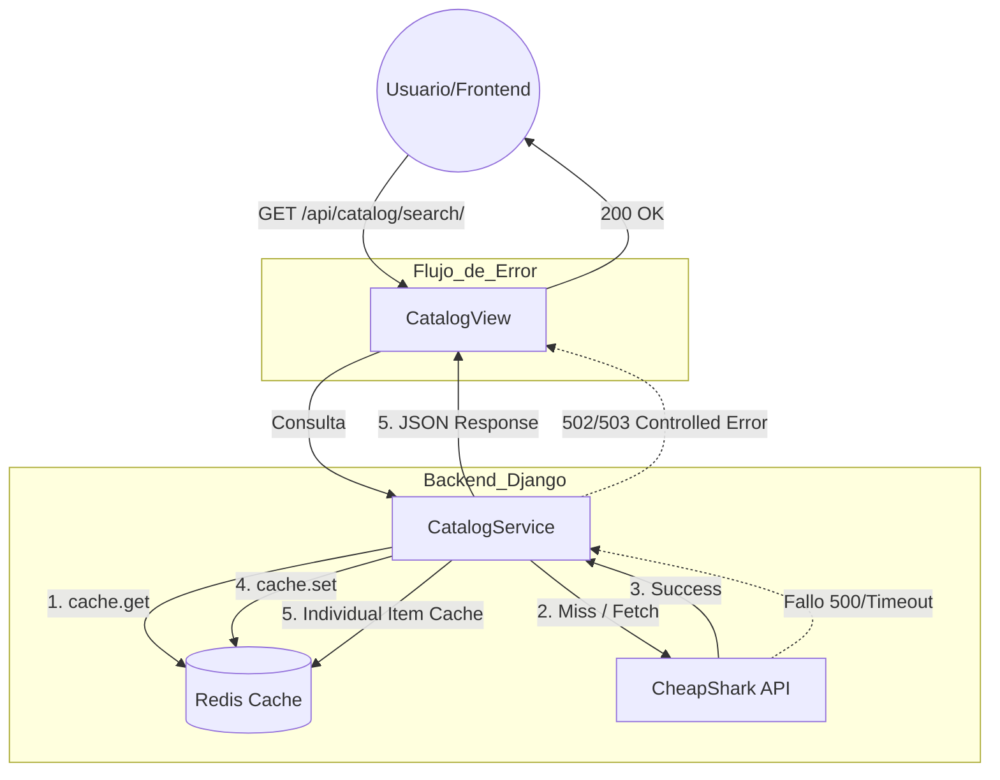

# Desarrollo Web en Entorno Servidor - Ejercicios Evaluables UA9
**Nombre del alumno:** Javier Molero

## Ejercicio 7: Diagrama y Explicación del Flujo

### Diagrama de Arquitectura (Caché Redis)



### Explicación del Flujo

1.  **Flujo Normal (Primera vez):**
    *   El usuario solicita una búsqueda (ej: "Batman").
    *   El `CatalogService` genera una clave única en Redis (`catalog_search_batman`).
    *   Como es la primera vez, Redis devuelve `None` (Cache Miss).
    *   El servicio llama a la API externa de **CheapShark**.
    *   Los resultados se transforman al formato del proyecto, se guardan en **Redis** con un tiempo de vida (TTL) de 5 minutos y se devuelven al usuario.

2.  **Flujo con Caché (Búsquedas posteriores):**
    *   Al repetir la misma búsqueda, el `CatalogService` encuentra los datos en **Redis** (Cache Hit).
    *   Se devuelven los datos instantáneamente **sin llamar a CheapShark**, ahorrando tiempo y tráfico de red.

3.  **Flujo cuando el Proveedor Falla (Ejercicio 4):**
    *   Si **CheapShark** no responde o devuelve un error, el `CatalogService` captura la excepción.
    *   Si los datos NO estaban en Redis (y la API falla), devolvemos un error controlado:
        *   **503 (Service Unavailable):** Si hay un timeout o fallo de red.
        *   **502 (Bad Gateway):** Si la API externa devuelve un error interno.

---

## Guía de Verificación (Ejercicio 6)

Para comprobar que todo funciona correctamente, sigue estos pasos:

1.  **Levantar el entorno:**
    ```bash
    docker-compose up --build
    ```
    Verifica que el servicio `redis` arranca en el puerto `6379`.

2.  **Probar la caché (Ejercicio 2):**
    *   Realiza una búsqueda desde el frontend o con Bruno.
    *   Revisa los logs (`docker-compose logs web`): verás mensajes como *"Consulta a Redis"* y *"Consulta al proveedor externo"*.
    *   Repite la búsqueda: verás el mensaje *"Uso de datos cacheados | Origen: Redis"*. La respuesta será inmediata.

3.  **Simular fallo del proveedor (Ejercicio 4 y 6):**
    *   Modifica el código en `library/catalog_service.py` o simplemente desconecta el cable de red/cambia la URL de la API a una inexistente.
    *   Si buscas algo que **YA estaba en caché**, seguirá funcionando perfectamente (resiliencia).
    *   Si buscas algo **NUEVO**, recibirás un error JSON profesional (502 o 503) en lugar de un error crudo de Django.

4.  **Revisar Logs (Ejercicio 5):**
    *   Ejecuta `docker-compose logs -f web` para ver en tiempo real cómo el sistema toma decisiones.
    *   Los logs incluyen: `Consulta a Redis`, `Uso de datos cacheados`, `Consulta al proveedor externo` y `Uso de Redis por fallo del proveedor`.

5.  **Verificación Rápida de Redis (Ejercicio 1):**
    *   Ejecuta el script de utilidad: `python manage.py shell < scratch/verify_redis.py`.
